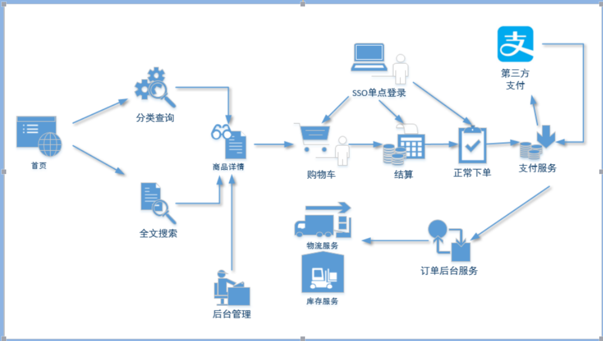
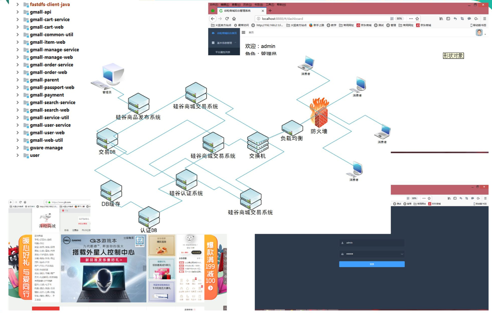
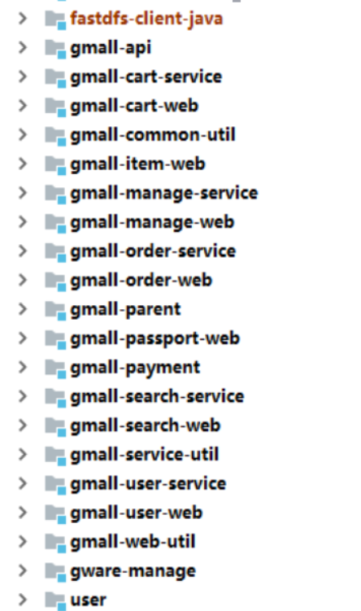
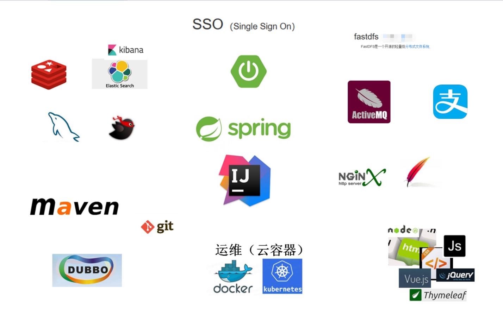
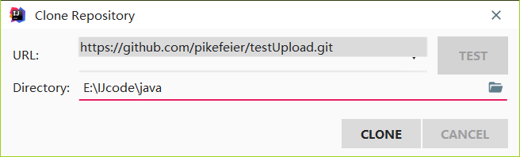
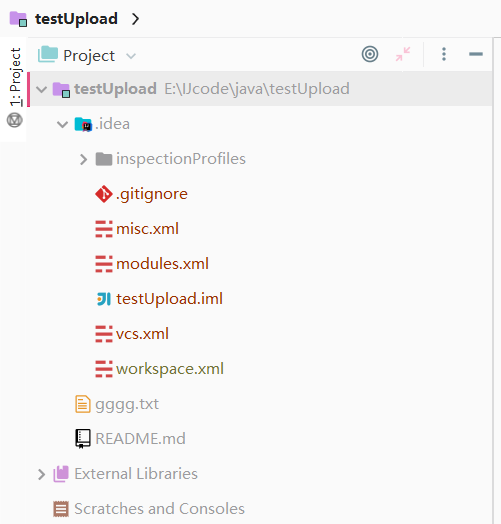
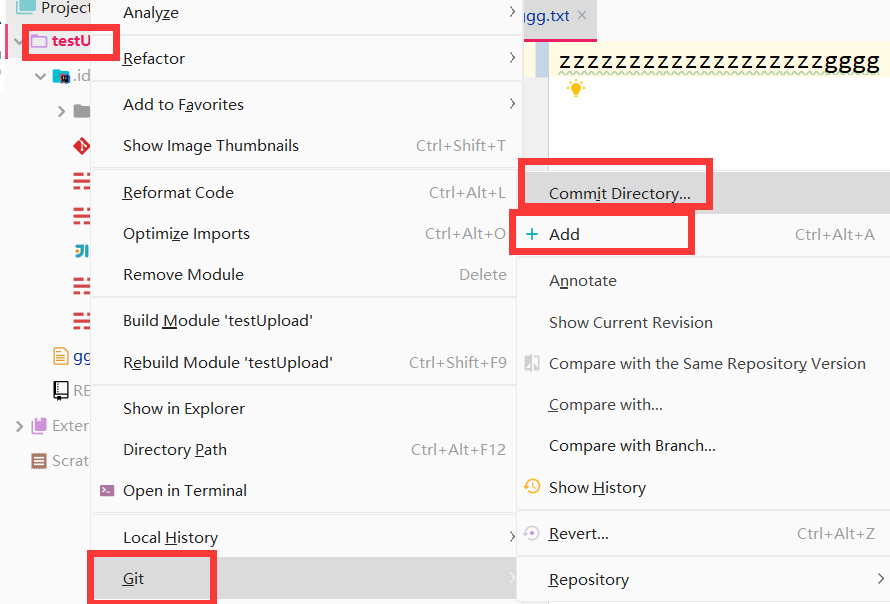
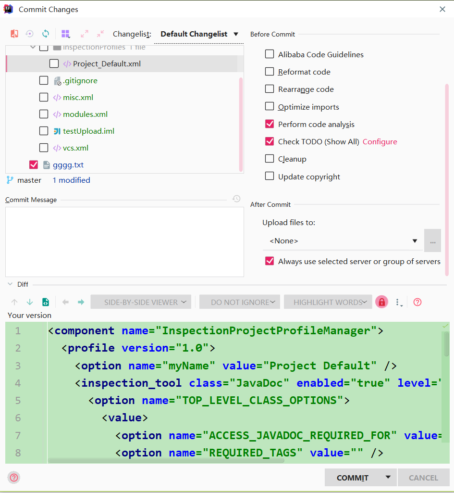
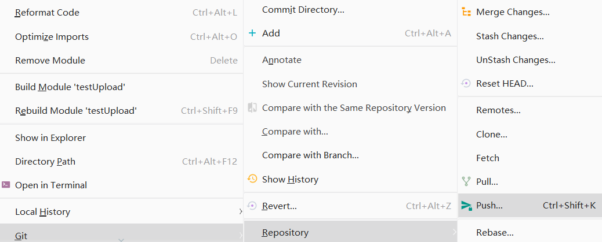

---

---

# springboot项目--谷粒商城

[TOC]

## 第O 天(工具)

### 1.颜色管理

* 颜色选择    [参考颜色文档](https://blog.csdn.net/weixin_37998647/article/details/79428290)

## 第一天   

### 1.项目介绍

* 逻辑图解  

* 项目展示 

* 项目后台 

* 项目用到的工具 

### 2.安装mysql

> 安装mysql服务端   [参考文档](https://www.jb51.net/article/92158.htm)

* 找到mysql的安装目录，cd（注意这里需要是管理员权限）到bin目录下，执行mysqld -install

 	2. 打开mysql服务：管理--服务中找到mysql服务启动

> 安装mysql客户端

*  mysql的Navicat 配置链接属性，用户名密码即可

### 3.安装jdk8

* java_home

* class_path

* path

****

### 4.配置IJ

1. 新建project工程，这里的project 类似于ecliipse中的workspace

   | project    >| moudule 

   | workspace  >| project

2. 两项基本配置

   ---- 由于project相当于工作空间，一个新的工作空间需要配置maven以及jdk版本

   * 配置Maven

     File->setting->搜索maven(配置setting.xml)

     注意：默认的maven是在c盘下的.m2文件夹下，可以通过配置xml来改变需要下载的respository文件夹（默认是被注释的）

     ~~~xml
     <!-- 指向地址的改变-->
     <localRespository>d:/.m2/respository</localRespository>
     <!-- 镜像选择国内的aliyun-->
     <mirror>
         <id>CN</id>
         <name>OSChina Central</name>
     <url>http://maven.aliyun.com/nexus/content/groups/public/</url>
     	<mirrorOf>central</mirrorOf>
     </mirror>
     ~~~

   * 配置project_structure

     springboot要求jsk8及以上

     File->Project Structure->Project SDK 

### 5.Git & GitHub

* **拉取项目**

对一个新的项目（project），此项目由GitHub上创建，然后在IJ上拉下来

File-> new -> project from version controller-> Git

- [ ] **提交代码**

  只有是从git上拉取下来的项目，在右键菜单里才有Git选项

  

  1. 如图上，先add，然后再commit Directory,如下图

  注意：一些本地配置文件不要提交**

  

  2. push到GitHub

  

